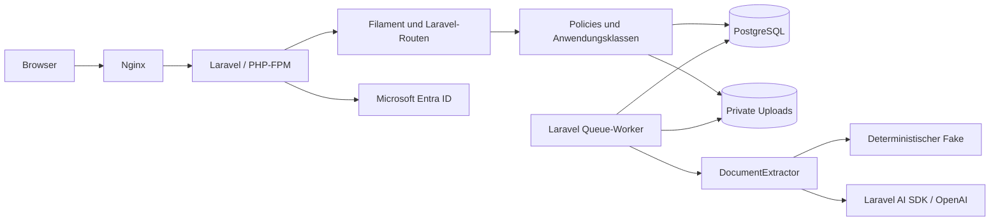

# Handbuch des KI-Anwendungstemplates

**Produkt, Architektur, Funktionsweise, Nutzung, Anpassung und Betrieb**

Dokumentationsstand: 15. September 2026. Grundlage sind der vorhandene Quellcode, die Lockfiles, die Containerkonfiguration und die dokumentierten lokalen Prüfungen.

Dieses Handbuch beschreibt das tatsächlich implementierte Template. Ergänzend bewertet die [technische Analyse](template-analyse.md) dessen Stärken, Grenzen, offene Aufgaben und sinnvolle Weiterentwicklung. Der [Prüfbericht](verification.md) hält fest, welche Nachweise ausgeführt wurden und welche noch fehlen. Aussagen über mögliche Erweiterungen sind keine Zusage, dass diese bereits eingebaut sind.

## Inhalt

1. [Zweck und wirtschaftlicher Nutzen](#zweck)
2. [Zielgruppe und Einsatzgrenzen](#zielgruppe)
3. [Funktionsumfang](#umfang)
4. [Technologie und Pakete](#technologie)
5. [Architektur und Verantwortlichkeiten](#architektur)
6. [Datenmodell und Zustände](#datenmodell)
7. [Anmeldung und Identität](#anmeldung)
8. [Rollen und Autorisierung](#rollen)
9. [Dokumentenablauf im Detail](#dokumentenablauf)
10. [KI-Anbindung und Validierung](#ki)
11. [Queue, Wiederholung und Nebenläufigkeit](#queue)
12. [Dateien, Datenschutz und Nachvollziehbarkeit](#daten)
13. [Lokaler Start und Bedienung](#lokal)
14. [Konfiguration](#konfiguration)
15. [Entwicklungswerkzeuge und Tests](#entwicklung)
16. [Ein neues Kundenprojekt beginnen](#kundenprojekt)
17. [Fachliche Anpassungen durchführen](#anpassung)
18. [Produktionsbetrieb und Deployment](#betrieb)
19. [Sicherung und Wiederherstellung](#backup)
20. [Wartung und Fehlerdiagnose](#wartung)
21. [Bewusst nicht enthaltene Funktionen](#nicht-enthalten)
22. [Begriffe und weiterführende Dokumentation](#quellen)

<a id="zweck"></a>
## 1. Zweck und wirtschaftlicher Nutzen

Das Template ist eine wiederverwendbare Grundlage für firmeninterne KI-Anwendungen. Es verbindet die wiederkehrenden technischen Aufgaben eines Kundenprojekts mit einem vollständig durchlaufbaren Beispiel: Eine Textdatei wird hochgeladen, im Hintergrund ausgewertet, von einem Menschen geprüft und korrigiert, ausdrücklich freigegeben und anschließend als CSV exportiert.

Der Nutzen liegt vor allem in der bereits verbundenen Infrastruktur. Ein neues Projekt muss nicht erneut klären, wie Anmeldung und Verwaltungsoberfläche dieselbe Session nutzen, wie Berechtigungen bei direkten Downloads geprüft werden, wie ein Modellaufruf einen Webrequest nicht blockiert oder wie ein verspätetes Ergebnis eine menschliche Korrektur respektiert. Diese Verbindungen sind implementiert und mit automatisierten Tests abgesichert.

Damit verschiebt sich die Arbeit eines Kundenprojekts auf die wirklich unterschiedlichen Fragen: Welche Informationen sollen gewonnen werden? Welche Eingaben sind zulässig? Wer darf welche Ergebnisse sehen und freigeben? Wie gut ist die Extraktion auf den tatsächlichen Kundendokumenten? Welche Betriebs- und Aufbewahrungsanforderungen gelten? Das Template beantwortet die technische Grundstruktur, nimmt diese fachlichen Entscheidungen aber nicht vorweg.

Es handelt sich um Quellcode, der für ein Kundenprojekt übernommen und gezielt verändert wird. Es ist kein fertiges Rechnungsverarbeitungssystem, kein frei konfigurierbarer Prozessbaukasten und keine Plattform, auf der bereits mehrere Kunden gemeinsam betrieben werden. Der mitgelieferte Rechnungsfall demonstriert das Zusammenspiel der Komponenten; er definiert nicht die spätere Produktgrenze.

Eine konkrete prozentuale Zeit- oder Kostenersparnis wurde nicht gemessen. Belastbar ist die Feststellung, dass die beschriebenen Integrationspunkte vorhanden sind und die Kernabläufe lokal geprüft wurden. Wie stark sich das wirtschaftlich auswirkt, hängt vom Umfang der fachlichen Anpassungen und den Vorgaben des jeweiligen Kunden ab.

<a id="zielgruppe"></a>
## 2. Zielgruppe und Einsatzgrenzen

Eine Installation gehört genau einer Firma. Vorgesehen sind kleine bis mittelgroße interne Anwendungen mit bis ungefähr 400 Benutzerkonten. Diese Kontenzahl ist eine Größenordnung für die Organisation, keine geprüfte Gleichzeitigkeit und kein zugesicherter Durchsatz.

Besonders gut passt das Template zu Aufgaben, bei denen ein KI-Ergebnis ein bearbeitbarer Vorschlag ist: Dokumentenprüfung, strukturierte Erfassung aus Texten, interne Klassifikation oder vorbereitende Sachbearbeitung. Der Nutzen ist hoch, wenn Benutzer eine bekannte Verwaltungsoberfläche mit Tabellen, Formularen und Freigaben benötigen und eine Hintergrundverarbeitung einige Sekunden dauern darf.

Die Architektur passt weniger gut zu einer öffentlich zugänglichen Verbraucherplattform, einem hochgradig interaktiven Echtzeitprodukt oder einem Dienst mit vertraglich geforderter unterbrechungsfreier Verfügbarkeit. Dafür wären unter anderem andere Lastannahmen, eine erweiterte Betriebsarchitektur und zusätzliche Produktfunktionen erforderlich. Ein Kubernetes-Cluster, mehrere Datenbankreplikate oder ein weiterer Dienst werden deshalb nicht vorsorglich eingebaut.

Die Installation auf einem einzelnen Server ist bewusst überschaubar. Sie begrenzt zugleich die Ausfallsicherheit: Fällt dieser Server aus, fällt die Anwendung aus. Ein Backup ermöglicht Wiederherstellung, aber keine automatische Fortführung auf einem zweiten System.

<a id="umfang"></a>
## 3. Funktionsumfang

| Bereich | Implementiertes Verhalten |
| --- | --- |
| Anmeldung | Microsoft Entra ID für einen fest konfigurierten Tenant; lokaler Demo-Login mit eigener Umgebungssperre |
| Benutzer | Lokale Aktivierung und drei feste Rollen; Schutz des letzten aktiven Administrators |
| Dokumente | Private PDF-/TXT-Uploads (PDF bis 8 MiB, TXT bis 256 KiB), Inhaltsprüfung und SHA-256-Prüfsumme |
| Hintergrundverarbeitung | Laravel-Datenbank-Queue, eigener Worker, begrenzte Wiederholungen und Wiederaufnahme verwaister Läufe |
| KI | Deterministischer Fake und echter OpenAI-Adapter über Laravel AI SDK |
| Prüfung | Originaltext, Ergebnisfelder, manuelle Korrektur, Versionsprüfung und ausdrückliche Freigabe |
| Export | Einzelnes freigegebenes Dokument als CSV, mit Schutz vor verbreiteten Formelpräfixen |
| Nachvollziehbarkeit | Ursprüngliches KI-Ergebnis, aktueller Bearbeitungsstand, Laufmetadaten und fachliche Audit-Einträge |
| Oberfläche | Filament-Ressourcen für Dokumente, KI-Läufe und Benutzerverwaltung |
| Qualität | Pint, PHPStan/Larastan, PHPUnit, Playwright, Paket-Audits und CI-Konfiguration |
| Entwicklung | Docker-Entwicklungsbetrieb, Boost und optionales lokales Telescope |
| Betrieb | Mehrstufige Images, Healthchecks, persistente Volumes sowie dokumentierte Deployment- und Restore-Abläufe |

Die Oberfläche zeigt für Dokumente Dateiname, Lieferant, Rechnungsnummer, Geschäftsstatus und Uploadzeit. Dateiname, Lieferant und Rechnungsnummer sind durchsuchbar; der Geschäftsstatus ist filterbar. Die KI-Laufübersicht zeigt unter anderem Status, Versuche und Fehlerkategorie. In der Laufdetailansicht stehen Modell, Promptversion, Eingaberevisionen, validiertes Ergebnis und verfügbare Tokeninformationen.

„Rollenverwaltung“ bedeutet hier, dass ein Administrator vorhandenen Benutzern eine der drei definierten Rollen zuweist. Es gibt keinen Editor für beliebige Rollen, keine konfigurierbaren Einzelrechte und keine Übernahme von Entra-Gruppen in lokale Berechtigungen.

<a id="technologie"></a>
## 4. Technologie und Pakete

### 4.1 Der tatsächlich gebundene Stand

Die folgende Tabelle beschreibt den geprüften Projektstand. Sie ist keine Behauptung, dass die Versionen bei jeder späteren Nutzung noch die neuesten Veröffentlichungen sind. Für PHP-Pakete ist `composer.lock`, für JavaScript-Pakete `package-lock.json` maßgeblich.

| Baustein | Version im Projektstand | Aufgabe |
| --- | --- | --- |
| PHP | 8.5.10 im Docker-Basisimage | Anwendung und Worker |
| Laravel | 13.31.0 | Routing, Sessions, Datenbank, Policies, Queue und Anwendungskonventionen |
| Filament | 5.8.1 | Serverseitig definierte Verwaltungsoberfläche |
| Livewire | 4.4.4 | Interaktive Formulare und Aktionen ohne getrennte SPA |
| PostgreSQL | 18.6 im Docker-Basisimage | Geschäftsdaten, Queue, Sessions und Cache |
| Laravel Socialite | 5.31.0 | OAuth-Ablauf und Session-State |
| SocialiteProviders/Microsoft | 4.10.0 | Microsoft-Endpunkte, Profilzugriff und ID-Token-Verifikation |
| Laravel AI SDK | 0.11.2 | Strukturierter OpenAI-Aufruf im Live-Adapter |
| Symfony Intl | 8.1.5 | Währungskennungen und Währungspräzision |
| PHPUnit | 12.5.35 | Automatisierte PHP-Tests |
| Larastan / PHPStan | 3.12.1 / 2.2.14 | Statische Analyse auf Level 8 |
| Laravel Pint | 1.32.1 | Einheitliche PHP-Formatierung |
| Playwright | 1.63.0 | Browserprüfung des tatsächlichen Ablaufs |
| Laravel Boost | 2.9.0 | Unterstützung von Coding-Agenten in der Entwicklung |
| Laravel Telescope | 5.24.0 | Optionales lokales Diagnose-Dashboard |
| Vite / Tailwind CSS | 8.3.0 / 4.3.3 | Asset-Build und Gestaltung |
| Laravel Vite Plugin | 3.2.0 | Verbindung zwischen Laravel und dem Asset-Build |

Weitere direkte Entwicklungsabhängigkeiten sind Faker 1.24.1 für Testdaten, Mockery 1.6.15 für Testdoubles, Collision 8.9.5 für Konsolenausgaben, Tinker 3.0.2 für lokale Interaktion, Pail 1.2.7 für Logbetrachtung und Pao 1.1.5 für agentengerechte Ausgaben von Entwicklungswerkzeugen. Ihre Installation allein bedeutet nicht, dass jedes dieser Werkzeuge Teil des verpflichtenden Prüfablaufs ist.

Composer löst zusätzlich transitive Abhängigkeiten auf. Beispielsweise bringt das AI SDK weitere Bibliotheken mit, ohne dass dadurch ein AWS-Dienst oder ein zusätzlicher Container im Template betrieben wird. Ebenso beweisen Framework-Konfigurationsabschnitte für Redis oder Mail nicht, dass solche Dienste eingerichtet sind. Entscheidend sind die verwendeten Treiber und der Compose-Aufbau.

### 4.2 Warum dieser Stack zusammenpasst

Laravel bildet eine gemeinsame technische Grundlage für HTTP, Datenbankzugriffe, Autorisierung und Hintergrundjobs. Dadurch können dieselben Anwendungsklassen sowohl aus Filament als auch aus zusätzlichen Laravel-Seiten verwendet werden. Ein späterer Exportendpunkt benötigt keine zweite Geschäftslogik.

Filament passt zu internen Anwendungen mit Tabellen, Formularen, Statusanzeigen und Verwaltungsaktionen. Livewire übernimmt die Browserinteraktion. „Serverseitig“ bedeutet dabei nicht „ohne JavaScript“: Im Browser laufen die Komponentenbibliotheken. Es gibt aber kein separat zu entwickelndes SPA-Produkt mit einer zweiten Authentifizierungs- und API-Schicht. Die grundlegende Arbeitsweise ist in der [Filament-Dokumentation](https://filamentphp.com/docs/5.x/introduction/overview) beschrieben.

PostgreSQL bündelt im Ausgangsstand mehrere Aufgaben in einem ohnehin benötigten Dienst. Die Datenbank-Queue spart die Einrichtung eines weiteren Queue-Backends. Das ist eine nachvollziehbare Ausgangsentscheidung für kleine Installationen; sie ersetzt keine spätere Messung der gemeinsamen Datenbanklast.

Das AI SDK wird bewusst bereits eingesetzt. Seine öffentliche Version liegt noch vor 1.0. Deshalb ist die Abhängigkeit auf `^0.11.2` beschränkt und zusätzlich durch das Lockfile fixiert. Eine Änderung auf eine neue Minor-Version muss aktiv vorgenommen und geprüft werden. Das Risiko einer sich entwickelnden SDK-Schnittstelle wird auf den kleinen Bereich unter `app/Ai` begrenzt.

<a id="architektur"></a>
## 5. Architektur und Verantwortlichkeiten

### 5.1 Ein Laravel-Monolith mit getrenntem Workerprozess

„Monolith“ bedeutet hier, dass Anwendung und Geschäftsregeln in einem Laravel-Projekt entwickelt und gemeinsam versioniert werden. Der Queue-Worker ist trotzdem ein eigener Betriebssystemprozess in einem separaten Container. Er verwendet dasselbe Anwendungsimage wie PHP-FPM, hat aber eine andere Startaufgabe.



Im Produktionsbetrieb liegt ein HTTPS-Abschluss vor Nginx. Dieser ist eine einzurichtende Betriebsumgebung und kein zusätzlicher Dienst in der mitgelieferten Compose-Datei. Die Browseroberfläche spricht mit Laravel; sie erhält keinen OpenAI-Schlüssel und ruft den Modellanbieter nicht direkt auf.

### 5.2 Die Grenzen im Quellcode

| Verzeichnis oder Klasse | Verantwortlichkeit | Gehört ausdrücklich nicht dorthin |
| --- | --- | --- |
| `app/Filament` | Felder, Tabellen, Dialoge, Darstellung und Delegation | Anbieteraufrufe oder eigenständige Freigabelogik |
| `app/Actions` | Fachliche Anwendungsfälle und Transaktionsgrenzen | Wiederholte Formulardefinitionen |
| `app/Policies` | Zentrale Regeln für handelnde Benutzer und Ressourcen | Verlassen auf bloß ausgeblendete Buttons |
| `app/Ai` | Extraktionsvertrag, Fake, SDK-Adapter und Ergebnisvalidierung | Änderung lokaler Benutzerrollen oder Freigabe von Dokumenten |
| `app/Jobs` | Anschluss an Laravel Queue und technische Wiederholung | Auf menschliche Entscheidungen wartende Prozesse |
| `app/Auth` | Zusätzliche Prüfung der Entra-Identitätsclaims | Lokale Rollenzuweisung aus externen Profildaten |
| `app/Models` | Eloquent-Modelle, Beziehungen und Casts | Vollständige Geschäftsprozesse als schwer sichtbare Seiteneffekte |
| `routes` / Controller | HTTP-Einstieg, Middleware und Antwortformate | Eine zweite, abweichende Variante derselben Geschäftsaktion |
| `docker`, `compose*.yaml`, `bin` | Laufzeit, Start, Prüfungen und Betrieb | Kundengeheimnisse im Quellcode |

Die zentrale Wirkung dieser Aufteilung ist Prüfbarkeit. `ApproveDocument` kann eine Freigabe unabhängig davon verweigern, ob sie über einen Filament-Dialog oder später über einen anderen autorisierten Einstieg ausgelöst wird. Die Policy und die Transaktion liegen am Anwendungsfall; ein manipuliertes Frontend kann sie nicht durch das Sichtbarmachen eines Buttons ersetzen.

Es gibt keine zusätzlichen Repository-Abstraktionen über Eloquent, keinen selbst erfundenen Event-Bus und kein Pluginsystem. Für die vorhandenen Anwendungsfälle würden sie mehr Übergänge als fachlichen Nutzen erzeugen. Sollte später tatsächlich ein zweites Speichersystem oder ein fachliches Ereignismodell erforderlich sein, kann dafür eine konkrete Grenze ergänzt werden.

### 5.3 Wichtige Anwendungsklassen

`UploadDocument` validiert und speichert das Original (PDF oder TXT) und legt den ersten Lauf an. `StartExtraction` autorisiert eine Verarbeitung und erzeugt eine dauerhafte Laufabsicht. `ProcessExtraction` übernimmt die Beanspruchung, den Aufruf und die kontrollierte Ergebnisübernahme. `CorrectDocument` validiert menschliche Änderungen und prüft die Bearbeitungsrevision. `ResetDocumentField` stellt einen einzelnen KI-Ursprungswert wieder her. `RestoreDocumentRevision` übernimmt einen früheren Auditstand als neue Revision. `ApproveDocument` führt die gesonderte Freigabe durch. `ExportDocument` autorisiert die CSV-Erzeugung. `SubmitGoldenDataset` sichert einen freigegebenen Stand als interne Evaluierungs-Fixture. `RejectAuditCleanup` verweigert die Löschung von Audit-Einträgen. `UpdateUserAccess` verwaltet Aktivierung und Rollen einschließlich des letzten Administrators.

Bei Änderungen sollte zuerst geklärt werden, welcher dieser Anwendungsfälle betroffen ist. Ein neues Feld im Formular ist häufig auch eine Änderung am Extraktionsvertrag, an der Validierung und am Export. Eine neue Rolle ist eine Änderung an den Policies, nicht lediglich an der Navigation.

<a id="datenmodell"></a>
## 6. Datenmodell und Zustände

### 6.1 Die vier fachlichen Tabellen

| Tabelle | Wesentlicher Inhalt | Bedeutung |
| --- | --- | --- |
| `users` | Anzeigename, E-Mail, Tenant-/Object-ID, Rolle, Aktivierung und Demo-Kennung | Lokales Benutzerkonto mit externer stabiler Identität |
| `documents` | Privater Dateipfad, MIME-Typ, Originalname, Prüfsumme, Eingabeversion, Bearbeitungsrevision, Geschäftsstatus und aktuelle Ergebnisfelder (acht Felder, siehe Abschnitt 9.3) | Der gegenwärtige fachliche Dokumentstand |
| `ai_runs` | Dokumentbezug, Eingabestand, Startrevision, Laufstatus, Anbieterkennung, Modell, Promptversion, Versuche, Lease, Ergebnis, Konfidenz und Tokenverbrauch | Geschichte der angeforderten KI-Verarbeitungen |
| `audit_entries` | Aktion, Benutzer, Dokument, Änderungen und Zeitpunkt | Nachvollziehbarkeit ausgewählter fachlicher Änderungen |

Daneben bestehen technische Tabellen unter anderem für Jobs, fehlgeschlagene Queue-Jobs, Sessions und den Datenbank-Cache. Die generierte Queue-Grundstruktur kann auch Tabellen enthalten, deren Framework-Funktion im Demoablauf nicht verwendet wird. Telescope ergänzt seine Tabellen ausschließlich über die lokale Migration. Für den Dokumentenfall werden keine SDK-Conversation-Tabellen angelegt.

### 6.2 Drei verschiedene Begriffe von „Version“

`input_version` bezeichnet die Version des zu verarbeitenden Eingabedokuments. Sie beginnt bei 1. Eine Oberfläche zum Ersetzen eines Originals und Hochzählen dieser Version ist noch nicht implementiert; die Prüfung auf unterschiedliche Eingabeversionen ist bereits vorhanden.

`revision` bezeichnet den Bearbeitungsstand des Dokuments. KI-Übernahme, Korrektur und Freigabe können ihn erhöhen. Wer eine Änderung absendet, muss sich auf den noch gültigen Stand beziehen. Das schützt gegen das Überschreiben einer inzwischen veränderten Fassung.

`prompt_version` bezeichnet die deklarierte Version des Extraktionsprompts. Sie dokumentiert, unter welcher Kennzeichnung der Lauf angelegt wurde. Sie ist derzeit keine vollständige Archivierung des damaligen Promptcodes. Welche Konsequenz das für spätere Promptänderungen hat, erläutert die [Analyse](template-analyse.md).

### 6.3 Geschäftsstatus und Verarbeitungsstatus

| Dokumentstatus | Bedeutung | Typischer Übergang |
| --- | --- | --- |
| `draft` | Noch kein vollständiger prüfbereiter Ergebnisstand | Nach Upload |
| `in_review` | Ergebnis liegt zur menschlichen Prüfung vor | Nach gültiger KI-Übernahme oder vollständiger manueller Korrektur |
| `approved` | Ein berechtigter Benutzer hat ausdrücklich freigegeben | Durch `ApproveDocument` |

| Laufstatus | Bedeutung |
| --- | --- |
| `queued` | Lauf wartet auf Verarbeitung oder einen begrenzten weiteren Versuch |
| `running` | Ein Worker hat den Lauf zeitlich begrenzt beansprucht |
| `succeeded` | Ein gültiges Ergebnis wurde gewonnen; die Übernahme kann trotzdem verhindert worden sein |
| `failed` | Der Lauf ist beendet und benötigt Prüfung oder einen autorisierten Neustart |

Ein Lauf kann `succeeded` sein, während `applied=false` bleibt. Das ist beispielsweise richtig, wenn zwischenzeitlich ein Mensch korrigiert hat. Der KI-Vorschlag bleibt als Laufresultat sichtbar, verändert aber den aktuellen Dokumentstand nicht. Die Fehlerkategorie `superseded` bezeichnet in diesem Fall die überholte Ergebnisübernahme und keinen fehlgeschlagenen Modellaufruf.

Freigegebene Dokumente sind in den implementierten Anwendungsfällen schreibgeschützt. Es gibt kein Wiederöffnen und keine Löschfunktion. Das ist eine Anwendungsregel; privilegierter direkter Datenbankzugriff wird damit nicht technisch unmöglich.

<a id="anmeldung"></a>
## 7. Anmeldung und Identität

### 7.1 Produktionsanmeldung mit Entra ID

Die produktive Anmeldung verwendet einen konfigurierten Microsoft-Entra-Tenant. Die Konfiguration akzeptiert für Tenant und Client konkrete UUIDs. Ein allgemeiner `common`- oder `organizations`-Tenant gehört nicht zum vorgesehenen Ablauf.

Beim Aufruf von `/auth/entra` erzeugt die Anwendung eine Nonce und speichert sie in der Laravel-Session. Socialite übernimmt den OAuth-State und aktiviert PKCE. Der Browser wird zum Microsoft-Anmeldeendpunkt des konfigurierten Tenants umgeleitet. Nach der Rückkehr tauscht der Provider den Autorisierungscode serverseitig gegen Tokens aus und liest die Benutzerinformationen.

Der installierte Microsoft-Provider prüft die ID-Token-Signatur anhand der von Microsoft veröffentlichten Schlüssel. Anschließend prüft `ValidateEntraClaims` zusätzlich den exakten Tenant, den exakten Issuer, die exakte Client-Audience, Ablaufzeit, zeitlichen Gültigkeitsbeginn, Object-ID und die einmalige Nonce. Diese zusätzliche Audience-Prüfung ist bewusst vorhanden: Der installierte Provider 4.10.0 verwendet an dieser Stelle intern einen Teilstringvergleich. Die Anwendung verlangt Gleichheit.

Die Nonce wird beim Callback aus der Session entnommen. Fehler führen zu einer allgemeinen Fehlermeldung und einem erneuten Anmeldebeginn; vertrauliche Tokeninhalte werden dabei nicht als Fehlertext ausgegeben. Nach erfolgreicher Anmeldung wird die Session-ID erneuert. Der dokumentierte Paketablauf basiert auf [SocialiteProviders/Microsoft](https://socialiteproviders.com/Microsoft/) und der [Microsoft-Beschreibung des Authorization Code Flow](https://learn.microsoft.com/en-us/entra/identity-platform/v2-oauth2-auth-code-flow).

### 7.2 Warum E-Mail keine Benutzeridentität ist

Die Verbindung zum externen Konto ist das Paar aus Tenant-ID `tid` und Benutzer-Object-ID `oid`. Die Datenbank sichert dessen Eindeutigkeit durch einen gemeinsamen Unique-Index. Name und E-Mail sind veränderliche Profildaten. Eine neue E-Mail-Adresse erzeugt deshalb nicht automatisch ein zweites Benutzerkonto und übernimmt keine anderen Berechtigungen.

Ein bisher unbekannter Entra-Benutzer wird lokal standardmäßig als inaktiver editor angelegt. Erst ein Administrator aktiviert das Konto. Eine erfolgreiche Identitätsprüfung bedeutet damit noch nicht, dass die Anwendung fachlich benutzt werden darf. Externe Rollen, Gruppen oder E-Mail-Domänen überschreiben die lokalen Rechte nicht.

### 7.3 Die gemeinsame Session und ihre Grenze

Filament und zusätzliche Anwendungsseiten verwenden den Laravel-Guard `web`. Es gibt keine getrennte Admin-Anmeldung mit einer zweiten Session und keine im Browser verwalteten API-Tokens für die Demoanwendung. In der Standardkonfiguration liegen Sessions in PostgreSQL; die Lebensdauer beträgt 120 Minuten. Sichere Cookie-Übertragung wird im Produktions-Compose für die Webanwendung erzwungen.

Logout beendet und invalidiert die lokale Session. Ein globaler Microsoft-Logout ist nicht implementiert. Auch eine spätere Sperre im Entra-Verzeichnis wird nicht kontinuierlich während jeder lokalen Sitzung abgefragt. Lokale Deaktivierung wirkt beim nächsten autorisierten Request; laufende Sitzungen allein durch Entra-Änderungen sofort zu widerrufen wäre ein zusätzlicher Anwendungsfall.

### 7.4 Erster Administrator und manuelle Einrichtung

Vor Kundenbetrieb sind eine App-Registrierung für einen einzelnen Tenant, die Tenant-/Client-ID, ein gültiges Client-Secret, die korrekten Redirect-URIs, Benutzerzuweisung und gegebenenfalls Administratorzustimmung einzurichten. MFA und Conditional Access werden in Entra konfiguriert, nicht im Template nachgebaut.

Der erste Administrator wird über die unabhängig verifizierte Object-ID per CLI aktiviert:

```sh
docker compose run --rm app php artisan app:bootstrap-admin '<Benutzer-Object-UUID>' --name='Vorname Nachname'
```

Das Kommando ist nur zulässig, solange kein aktiver Administrator existiert. Ein PostgreSQL-Advisory-Lock serialisiert die Bootstrap- und Administratoränderungen. Es gibt keine öffentliche Bootstrap-Route. Der CLI-Vorgang wird im Audit protokolliert, hat aber naturgemäß keinen bereits angemeldeten Webbenutzer als Akteur. Die vollständigen Einrichtungsschritte stehen in [Entra einrichten](entra.md).

<a id="rollen"></a>
## 8. Rollen und Autorisierung

### 8.1 Die konkrete Berechtigungsmatrix

Alle Angaben setzen ein aktives Konto voraus.

| Aktion | editor | reviewer | admin | Zusätzliche Bedingung |
| --- | --- | --- | --- | --- |
| Dokumente und KI-Läufe ansehen | Ja | Ja | Ja | Alle Dokumente dieser Installation |
| PDF-/TXT-Datei hochladen | Ja | Ja | Ja | Zulässige Datei (PDF bis 8 MiB, TXT bis 256 KiB) |
| Original herunterladen | Ja | Ja | Ja | Autorisierter Dokumentzugriff |
| Ergebnis korrigieren | Ja | Ja | Ja | Dokument noch nicht freigegeben |
| Fehlgeschlagene Verarbeitung neu anfordern | Ja | Ja | Ja | Letzter Lauf fehlgeschlagen, Dokument nicht freigegeben, kein aktiver Lauf |
| Dokument freigeben | Nein | Ja | Ja | `in_review`, gültige Daten, passende Revision |
| CSV exportieren | Nein | Ja | Ja | `approved` |
| Benutzer und Rollen verwalten | Nein | Nein | Ja | Letzter aktiver Administrator muss erhalten bleiben |
| Telescope aufrufen | Nein | Nein | Ja | Nur lokal und ausdrücklich aktiviert |

Der Begriff reviewer beinhaltet damit die editor-Rechte; admin beinhaltet die reviewer-Rechte. Es gibt keinen Vier-Augen-Zwang: Ein reviewer oder admin darf auch ein eigenes Dokument freigeben. Es gibt ebenfalls keine Abteilungs- oder Eigentümergrenze. Diese Annahmen müssen bei jedem Kunden bewusst bestätigt oder geändert werden.

### 8.2 Wo die Regeln durchgesetzt werden

Die Policies laden den Benutzer erneut und verweigern inaktive Konten. Die Middleware `EnsureActiveUser` aktualisiert ebenfalls den Benutzer und beendet eine Sitzung bei Deaktivierung. Filament wendet die Authentifizierungsmiddleware persistent auf seine Interaktionen an; zusätzliche Dokumentrouten benutzen dieselbe aktive Benutzerprüfung.

Downloads, Exporte und Statusabfragen autorisieren ausdrücklich. Korrektur, Freigabe, Neustart und Benutzeränderung autorisieren außerdem in ihren Anwendungsklassen. Dadurch bleibt eine direkte Aktionsausführung geschützt. Die Oberfläche blendet unzulässige Möglichkeiten zusätzlich aus, ist aber nicht die Sicherheitsgrenze.

Rollenänderungen greifen beim nächsten Request. Sie können bereits abgeschlossene Downloads nicht zurückholen und stoppen nicht rückwirkend jeden schon laufenden Request. Diese zeitliche Grenze ist für die Interpretation von „sofort wirksam“ wichtig.

<a id="dokumentenablauf"></a>
## 9. Dokumentenablauf im Detail

### 9.1 Upload

Filament nimmt zunächst einen temporären privaten Upload entgegen. `UploadDocument` prüft zusätzlich serverseitig die Uploadgültigkeit, die tatsächliche Bytegröße gegen das typabhängige Limit (TXT 256 KiB, PDF 8 MiB) sowie je Typ: bei TXT Dateiendung `txt`, gültiges UTF-8, nicht leeren Inhalt und keine unzulässigen binären Steuerzeichen; bei PDF Dateiendung `pdf`, `%PDF-`-Kopf, `%%EOF`-Ende und MIME-Typ `application/pdf`. Eine Dateiendung allein reicht also nicht aus, um ein Dokument anzunehmen.

Das Original wird auf dem privaten Storage-Disk mit einem erzeugten Pfad und gespeichertem MIME-Typ abgelegt. PDFs werden in der Detailseite über einen autorisierten Inline-Endpunkt im iframe vorgeschaut; TXT wird als Text ausgegeben. Der ursprüngliche Dateiname dient als Anzeigeinformation, nicht als frei wählbarer Speicherpfad. Eine SHA-256-Prüfsumme ermöglicht die spätere Prüfung, ob der gespeicherte Inhalt noch zum Dokumentdatensatz passt.

Anschließend legt eine Datenbanktransaktion Dokument, ersten KI-Lauf und Audit-Eintrag an. Scheitert diese Transaktion, versucht die Anwendung, die zuvor gespeicherte Datei wieder zu entfernen. Dateisystem und Datenbank sind trotzdem keine gemeinsame atomare Transaktion: Ein harter Prozessabbruch zwischen Dateischreiben und Datenbankabschluss kann eine verwaiste Datei hinterlassen. Dafür existiert noch kein gesonderter Bereinigungslauf.

### 9.2 Hintergrundverarbeitung und Anzeige

Der Job wird nach dem Datenbank-Commit zugestellt. Der Browser wartet nicht auf den Modellaufruf. Auf der Dokumentdetailseite fragt Livewire den Verarbeitungsstand alle drei Sekunden ab, solange ein Lauf `queued` oder `running` ist. Sobald kein solcher Lauf mehr besteht, wird das Polling entfernt.

Der Worker liest das private Original, prüft die Eingabeversion und die Prüfsumme, ruft den gewählten Extractor auf und validiert das Ergebnis. Bei erfolgreicher und noch aktueller Übernahme setzt er die Ergebnisfelder und `in_review`. Er setzt niemals `approved`.

### 9.3 Menschliche Korrektur

Die Bearbeitungsseite zeigt Originaltext und Ergebnisfelder. `CorrectDocument` sperrt den Dokumentdatensatz, prüft die Berechtigung und vergleicht die vom Formular geladene Revision mit dem aktuellen Stand. Bei einer zwischenzeitlichen Änderung wird das Speichern abgelehnt; der Benutzer muss neu laden.

Eine Korrektur enthält im gegenwärtigen Formular immer alle Pflichtfelder. Unvollständige Teilergebnisse können nicht als beliebiger Zwischenentwurf gespeichert werden. Ein vollständig und gültig manuell erfasster Stand kann hingegen auch dann `in_review` werden, wenn die KI noch läuft oder fehlgeschlagen ist. Die Anwendung verlangt vor Freigabe keinen erfolgreichen KI-Lauf, sondern einen gültigen menschlich prüfbaren Dokumentstand.

Vorherige und neue Feldwerte werden im Korrektur-Audit festgehalten. Das ursprüngliche KI-Ergebnis bleibt im zugehörigen `ai_runs.result` erhalten. So lässt sich unterscheiden, was der Anbieter geliefert und was ein Mensch verändert hat.

### 9.4 Freigabe

Ein reviewer oder admin bestätigt die Freigabe in einem Dialog. `ApproveDocument` prüft Berechtigung, Dokumentstatus und Revision innerhalb einer Transaktion erneut. Auch die fachliche Ergebnisvalidierung wird nochmals ausgeführt. Erst danach werden `approved`, Freigabezeitpunkt und Benutzer gesetzt und ein Audit-Eintrag geschrieben.

Diese Wiederholungsprüfung ist gewollt. Zwischen Anzeige und Bestätigung können Daten geändert worden sein. Ein bestätigter Dialog allein beweist nicht, dass noch derselbe Dokumentstand freigegeben wird.

### 9.5 CSV-Export

`ExportDocument` lädt den aktuellen Stand und prüft die Export-Policy. Der Export enthält eine Kopfzeile und genau ein Dokument mit Lieferant, Rechnungsnummer, Rechnungsdatum, Gesamtbetrag, Währung, Netto, Umsatzsteuer und IBAN. Verwendet werden Semikolon, UTF-8 mit BOM und CRLF-Zeilenenden. Das erleichtert die Nutzung in verbreiteten Tabellenkalkulationen; eine konkrete ERP-Importspezifikation ist damit noch nicht erfüllt.

Zellen mit gefährlichen Formelanfängen werden durch ein vorangestelltes Apostroph als Text markiert. Das betrifft auch einen negativen Betrag. Für einen maschinellen Folgeimport kann deshalb eine eigene, ausdrücklich spezifizierte Exportvariante erforderlich sein. Die jetzige Entscheidung priorisiert die sichere Öffnung in einer Tabellenkalkulation gegenüber einer uneingeschränkten Weiterinterpretation aller Zellen als Zahlen.

Der Audit-Eintrag dokumentiert die erfolgreiche CSV-Erzeugung durch den Server. Er beweist nicht, dass der Browser die gesamte Datei empfangen oder ein Benutzer sie gespeichert hat. Jeder erneute Export kann einen weiteren Audit-Eintrag erzeugen.

### 9.6 Interner Golden-Datensatz zur Extraktionsbewertung

Ein admin kann ein freigegebenes PDF-Dokument über „Golden-Datensatz speichern“ als Evaluierungs-Fixture sichern. `SubmitGoldenDataset` prüft erneut Berechtigung, Prüfsumme und Rechenregeln und legt Original plus erwartete Felder (`original.pdf`, `expected.json`) unter `GOLDEN_DATASET_PATH` (Standard `tests/Fixtures/GoldenDataset`, eigenes Volume) ab. `php artisan ai:eval` misst daran Trefferquote und Konfidenz des gewählten Treibers; ohne `--allow-external` wird nichts an einen Anbieter übertragen, der Bericht enthält keine Dokumentinhalte. Fixtures sind interne Qualitätsdaten und gehören nicht in Git.

<a id="ki"></a>
## 10. KI-Anbindung und Validierung

### 10.1 Die fachliche Schnittstelle

`DocumentExtractor` trennt die Anwendungslogik vom Anbieter. Der Eingang `ExtractionInput` enthält Text, Versuchsnummer, Modell, Promptversion, das gegebenenfalls verwendete Fake-Szenario und den MIME-Typ. `ExtractionResult` enthält Ergebnisfelder, die KI-Selbsteinschätzung je Feld und optionale Tokeninformationen. Der Worker muss keine anbieterspezifischen HTTP-Antworten verstehen.

Diese Grenze ist klein genug, um verständlich zu bleiben. Sie ist keine universelle Abstraktion für alle möglichen KI-Funktionen. Ein späterer Chat, ein Embedding-Auftrag oder eine Bildanalyse benötigt nicht zwangsläufig denselben fachlichen Vertrag.

### 10.2 Der Fake

Der Fake ist der Standardtreiber. Er liefert reproduzierbare Demonstrationswerte; die Rechnungsnummer wird aus einem Hash des Eingabetextes abgeleitet. Er liest keinen echten Lieferanten oder Betrag aus dem Text. Seine angegebenen Tokenzahlen sind ebenfalls Demonstrationswerte und keine Verbrauchsmessung.

| Szenario | Verhalten | Zweck |
| --- | --- | --- |
| `success` | Standardmäßig etwa acht Sekunden warten, dann feste gültige Werte liefern | Sichtbarer Hintergrundablauf |
| `timeout` | Vorübergehenden Timeout melden | Wiederholungsbudget und Fehleranzeige |
| `rate_limit` | Ersten Versuch ablehnen, folgenden Versuch erfolgreich beantworten | Kontrollierten Backoff prüfen |
| `invalid` | Unvollständiges Ergebnis liefern | Serverseitige Ablehnung ungültiger Daten |

Automatisierte Tests setzen die Verzögerung auf null. Der simulierte Timeout ist eine fachliche Fehlersimulation; er ist kein acht Sekunden lang ausgeführter echter Netzwerk-Timeout. Der echte Transport-Timeout wird gesondert durch HTTP-Fixtures geprüft.

### 10.3 Der Live-Adapter mit Laravel AI SDK

`OpenAiDocumentExtractor` verwendet den OpenAI-Provider des Laravel AI SDK und den strukturierten Agenten `InvoiceExtraction`. Der Agent deklariert ein striktes Schema, maximal einen Schritt und maximal 1.000 Ausgabetokens. Das Modell wird aus dem Lauf übergeben und nicht vom SDK beliebig gewählt. Der voreingestellte Snapshot ist `gpt-4.1-mini-2025-04-14`.

Der konfigurierte Endpunkt ist die OpenAI Responses API unter `https://api.openai.com/v1/responses`. `AI_URL` bleibt eine vollständige Endpoint-URL; der Adapter leitet daraus die vom SDK benötigte Basis-URL ab. Eine geänderte URL ist Betreiberkonfiguration, keine frei vom Dokument oder Browser wählbare Adresse. Der Adapter setzt HTTPS und den abschließenden Pfad `/responses` voraus.

Der SDK-Aufruf erhält keine Tools, keine vorherige Unterhaltung und keine Möglichkeit, Geschäftsaktionen auszuführen. `store=false` wird gesetzt. Das ist keine umfassende Zusicherung zur Datenaufbewahrung durch den Anbieter; eine Kundenfreigabe der Datenübermittlung bleibt gesondert erforderlich. Bei TXT wird der gesamte eingereichte Text übertragen; bei PDF wird das Original als Dokumentanhang mit kurzer Extraktionsanweisung übergeben.

`DocumentOpenAiGateway` ergänzt den SDK-Transport um einen Verbindungs-Timeout von fünf Sekunden und deaktivierte HTTP-Redirects. Vor der SDK-Dekodierung prüft es den Antwortstatus, die grundlegende Outputstruktur und eine mögliche Verweigerung. Fehler werden in verständliche Kategorien übersetzt, ohne die vollständige Providerantwort oder einen geheimnishaltigen Exception-Vorgänger weiterzureichen.

Die Anwendung nutzt hier gezielt die strukturierte Ausgabe des SDK. Streaming, Tool Calling, Agent Conversations, Embeddings, Bilder und weitere Anbieter sind nicht als Templatefunktionen integriert. Welche Möglichkeiten das SDK darüber hinaus bietet, beschreibt die [offizielle SDK-Dokumentation](https://laravel.com/docs/13.x/ai-sdk); deren Verfügbarkeit ist nicht mit einer Umsetzung im Template gleichzusetzen.

### 10.4 Warum strukturierte Ausgabe allein nicht reicht

Das Modellschema verlangt acht Ergebnisfelder (Lieferant, Rechnungsnummer, Rechnungsdatum, Gesamtbetrag, Währung sowie optional Netto, Umsatzsteuer, IBAN) und eine Konfidenzzahl zwischen 0 und 1 je Feld. Anschließend prüft `ValidateExtraction` unabhängig vom Modell, ob die Antwort ein Objekt mit den erlaubten Feldern ist, alle Pflichtfelder vorhanden sind und ihre Inhalte den Regeln entsprechen. Unbekannte Felder werden zurückgewiesen. Die Pflichtfelder Lieferant, Rechnungsnummer, Rechnungsdatum, Gesamtbetrag und Währung müssen stets vorhanden sein; die Konfidenz beeinflusst die Übernahme nicht, sie wird nur angezeigt und gespeichert.

| Feld | Aktuelle fachliche Prüfung |
| --- | --- |
| Lieferant | Nicht leerer String, höchstens 255 Zeichen |
| Rechnungsnummer | Nicht leerer String, höchstens 120 Zeichen |
| Rechnungsdatum | Tatsächlich gültiges Datum im Format `YYYY-MM-DD` |
| Gesamtbetrag | Dezimalstring, kein Float, keine Exponentialschreibweise, begrenzte Stellenzahl |
| Währung | Bekannte dreistellige ISO-Währungskennung in Großbuchstaben |

Zusätzlich werden die relevanten Nachkommastellen mit der Währung abgeglichen. Nachgestellte Nullen erhöhen dabei nicht die fachliche Präzision. Speicherung und Eloquent-Cast verwenden eine präzise Dezimaldarstellung mit vier Nachkommastellen. Negative Beträge sind erlaubt, um beispielsweise Gutschriften darzustellen.

Die Validierung beweist Form und Plausibilität innerhalb dieser Regeln. Sie beweist nicht, dass der gelesene Betrag tatsächlich zur Rechnung gehört oder der Lieferant richtig erkannt wurde. Es fehlen beispielsweise eine mathematische Prüfung von Rechnungspositionen, Dublettenerkennung, Steuerregeln, ein Lieferantenstammabgleich und eine gemessene Erkennungsqualität. Deshalb bleibt die menschliche Freigabe zentral.

<a id="queue"></a>
## 11. Queue, Wiederholung und Nebenläufigkeit

### 11.1 Die drei Phasen einer Verarbeitung

Eine lange Datenbanktransaktion während eines Modellaufrufs würde Sperren unnötig halten und andere Benutzer behindern. `ProcessExtraction` trennt deshalb die Verarbeitung in drei Phasen:

1. **Beanspruchen:** In einer kurzen Transaktion wird der Lauf gesperrt und geprüft. Ein bereits beendeter Lauf, eine noch aktive Lease oder ein noch nicht fälliger Versuch wird nicht erneut verarbeitet. Ein neuer Versuch erhält eine zufällige Besitzerkennung, eine Ablaufzeit und einen erhöhten Versuchszähler.
2. **Extrahieren:** Außerhalb einer offenen Anwendungstransaktion liest der Worker das Original, prüft Version und Hash und ruft den Extractor auf. Hier darf der externe Dienst Zeit benötigen.
3. **Übernehmen:** Eine neue kurze Transaktion sperrt Dokument und Lauf. Nur der noch gültige Besitzer mit gültiger Lease darf abschließen. Eingabeversion, Bearbeitungsrevision und Freigabestatus bestimmen, ob die Felder noch übernommen werden dürfen.

```mermaid
sequenceDiagram
    participant UI as Benutzer / Oberfläche
    participant DB as PostgreSQL
    participant W as Worker
    participant AI as Extractor
    UI->>DB: Dokument und Lauf anlegen
    Note over UI,DB: Commit, danach Queue-Dispatch
    W->>DB: Lauf sperren und Lease beanspruchen
    W->>AI: Extraktion ohne offene DB-Transaktion
    opt Mensch korrigiert inzwischen
        UI->>DB: Felder ändern, Revision erhöhen
    end
    AI-->>W: Ergebnis
    W->>DB: Besitzer, Lease und Revision prüfen
    Note over W,DB: Aktuell: übernehmen; überholt: nur Laufresultat speichern
```

### 11.2 Die abgestimmten Zeitgrenzen

| Grenze | Ausgangswert | Zweck |
| --- | --- | --- |
| Verbindungsaufbau zum KI-Anbieter | 5 Sekunden | Verbindungsprobleme früh erkennen |
| Gesamter KI-HTTP-Request | 30 Sekunden | Modellaufruf zeitlich begrenzen |
| Laravel-Job | 60 Sekunden | Verarbeitung einschließlich Ein-/Ausgabe begrenzen |
| Lauf-Lease | 90 Sekunden | Kurzzeitig parallele Besitzer verhindern |
| Queue `retry_after` | 120 Sekunden | Reservierten Job erst später erneut zustellbar machen |
| Recovery-Alter seit Dispatch | 180 Sekunden | Verwaiste Zustellabsichten erneut aufgreifen |
| Geordnetes Stoppen des Workers | 75 Sekunden | Regulären 60-Sekunden-Job vor Prozessende abschließen lassen |

Die Anwendung prüft beim Booten die konfigurierte Reihenfolge HTTP < Job < Lease < Queue-Reservierung. Die Jobdauer ist zusätzlich in Jobklasse und Workerkommando festgelegt. Wer diese Werte ändert, muss die beteiligten Stellen gemeinsam anpassen; eine einzelne Umgebungsvariable ist dafür nicht ausreichend. Laravel erläutert die Bedeutung von Job-Timeout und `retry_after` in der [Queue-Dokumentation](https://laravel.com/docs/13.x/queues).

### 11.3 Wiederholungen und Fehlerbudget

Vorübergehende Fehler wie Timeout, Rate Limit oder vorübergehende Anbieterprobleme dürfen bis zum Gesamtbudget von drei Modellversuchen wiederholt werden. Nach dem ersten Fehler beträgt die Pause zehn, danach dreißig Sekunden. Ungültige Ergebnisse, verweigerte Antworten oder Konfigurationsfehler werden nicht durch unbegrenztes Wiederholen behandelt.

Es existiert keine zusätzliche HTTP-Retry-Schleife und kein SDK-Failover. Laravel zählt technische Jobversuche; zusätzlich begrenzt der gespeicherte Lauf die tatsächlichen Extraktionsversuche. Auch bei einer erneuten technischen Zustellung kann der fachliche Lauf dadurch sein Budget nicht einfach neu beginnen.

Ein autorisierter manueller Neustart ist ein neuer KI-Lauf. Das erhält die alte Fehlgeschichte und erlaubt, die neue Anforderung mit neuer Konfiguration nachvollziehbar zu behandeln. Ein erfolgreicher Lauf kann nicht beliebig über dieselbe Aktion erneut gestartet werden: Die aktuelle Retry-Regel verlangt den letzten Lauf im Zustand `failed`.

### 11.4 Wiederanlauf und Idempotenz

Der Laufdatensatz wird vor dem Dispatch festgeschrieben. Scheitert danach das Zustellen des Queue-Jobs, bleibt dieser Datensatz als dauerhafte Absicht erhalten. `ai:recover` findet fällige, nicht mehr beanspruchte Läufe und stellt sie erneut zu. Der Befehl besitzt einen eigenen Datenbank-Cache-Lock und wird beim Workerstart ausgeführt. Für laufenden Betrieb ist zusätzlich der dokumentierte minütliche Host-Cron einzurichten.

Nach einem harten Workerabbruch kann die Queue-Reservierung auslaufen und die Lease neu beansprucht werden. Reicht das Versuchskontingent nicht mehr, wird der Lauf nachvollziehbar als fehlgeschlagen abgeschlossen. Menschliche Prüfung hält dabei keinen Worker offen: Sie wird durch Dokumentstatus und Benutzeraktionen abgebildet.

Idempotenz bedeutet hier, dass dieselbe fachliche Ergebnisübernahme nicht mehrfach erfolgt und Benutzerkorrekturen nicht durch einen alten Besitzer überschrieben werden. Es bedeutet nicht, dass der Anbieter bei jedem Verbindungsabbruch garantiert nur einen abrechenbaren Request gesehen hat. Ebenso kann eine künstliche Umgebung, die Prozesse länger als sämtliche Timeouts einfriert, eine bereits extern gestartete Anfrage nicht durch eine lokale Lease zurückholen.

<a id="daten"></a>
## 12. Dateien, Datenschutz und Nachvollziehbarkeit

Private Dateien liegen unter `storage/app/private` in einem persistenten Upload-Volume. Sie werden nicht durch einen öffentlichen Storage-Symlink angeboten. Temporäre Livewire-Uploads benutzen ebenfalls den privaten Disk. Ein Originaldownload läuft über einen autorisierten Controller und wird als Textdatei mit Downloadheadern, `nosniff` und `private, no-store` ausgeliefert.

Originaltexte werden als Text ausgegeben. Zeichenfolgen wie `<script>` dürfen in einem TXT vorkommen, werden aber nicht als Anwendungscode interpretiert. Auf der KI-Seite ist derselbe Inhalt unzuverlässige Eingabe. Prompt-Anweisungen können die Verarbeitung leiten; sie ersetzen weder das Fehlen von Tools noch die serverseitige Ergebnisprüfung.

Privat gespeichert bedeutet nicht automatisch verschlüsselt gespeichert. Die Originaldateien, fachlichen Ergebnisfelder und Auditänderungen werden im Template nicht gesondert auf Anwendungsebene verschlüsselt. Auch die Datenbank-Sessionverschlüsselung ist standardmäßig nicht aktiviert. Wer Verschlüsselung im Ruhezustand benötigt, muss das über die Betriebsumgebung oder eine bewusst entworfene zusätzliche Lösung umsetzen.

Die Anwendung vermeidet vollständige Dokumente, API-Schlüssel und rohe Providerantworten in gewöhnlichen Fehlerlogs. Nginx-Access-Logging ist deaktiviert, um unter anderem OAuth-Code- und Query-String-Protokollierung zu vermeiden. Ein vorgeschalteter HTTPS-Proxy oder die Infrastruktur besitzt jedoch eigene Loggingregeln; diese müssen ebenfalls passend eingerichtet werden.

Das Audit ist für fachliche Nachvollziehbarkeit vorgesehen. Es enthält zum Beispiel Korrekturwerte und ist damit selbst schützenswert. Es ist kein unveränderbares, gegen einen Datenbankadministrator abgesichertes Archiv. Es gibt derzeit weder eine besondere Audit-Verwaltungsoberfläche noch eine implementierte Aufbewahrungs- und Löschautomatik. Rechtliche Eignung oder eine bestimmte Zertifizierung wird nicht behauptet.

<a id="lokal"></a>
## 13. Lokaler Start und Bedienung

### 13.1 Einmalig starten

Für den containerbasierten Einstieg werden Docker Engine beziehungsweise Docker Desktop und Docker Compose v2 benötigt. PHP, Composer und Node müssen für den Initialstart nicht auf dem Host installiert sein.

```sh
./bin/dev init
```

Existiert noch keine `.env`, kopiert der Ablauf die Beispieldatei, erzeugt zufällige lokale APP_KEY-/Datenbankgeheimnisse und aktiviert den Entwicklungslogin. Eine vorhandene `.env` bleibt erhalten. Anschließend werden Entwicklungsimage, Composer-Abhängigkeiten aus dem Lockfile, Migrationen, lokale Demo-Benutzer und Assets eingerichtet und die vier Dienste gestartet.

`init` ist ein lokaler Einrichtungsbefehl, kein Produktionsdeployment. Er führt lokale Seeds aus. Wiederholtes Seeden aktiviert die Demo-Konten und weist ihnen wieder ihre vorgesehene Rolle zu. Damit eignet sich der Befehl auch nicht als unbemerkter täglicher Neustart, wenn gerade Änderungen an Demo-Benutzern untersucht werden.

Der normale lokale Einstieg ist `http://localhost:8080/login`. Die Demo-Konten editor, reviewer und admin benötigen kein Passwort. Fehlt bei einer bereits existierenden `.env` die Aktivierung, `DEV_LOGIN_ENABLED=true` setzen und die Dienste neu erstellen lassen.

### 13.2 Bestehende Installation bedienen

```sh
./bin/dev up
./bin/dev artisan migrate
./bin/dev artisan ai:recover
./bin/dev down
```

`up` startet beziehungsweise aktualisiert Container aus den vorhandenen Images; es ist kein automatischer Neubau sämtlicher Abhängigkeiten. `down` entfernt den laufenden Compose-Aufbau, erhält aber die benannten Datenvolumes. Ein zusätzliches `--volumes` gehört nicht zum normalen Stopp und würde eine andere, datenlöschende Operation bedeuten.

### 13.3 Im eigenen Netzwerk öffnen

Für eine LAN-Demo werden in der lokalen `.env` die Serveradresse und der Bindewert gesetzt:

```dotenv
WEB_BIND_ADDRESS=<LAN-IP-des-Servers>
APP_URL=http://<LAN-IP-des-Servers>:8080
```

Danach `./bin/dev up` ausführen. Die aktuell eingerichtete Demo wurde unter `http://192.168.178.200:8080/login` geprüft. Diese Adresse ist eine Eigenschaft dieser Entwicklungsumgebung und wird nicht als allgemeine Kundeneinstellung in das Template übernommen. Bei LAN-Bindung werden die passwortlosen Demo-Konten im erreichbaren Netz angeboten; sie sind kein produktives Zugangsverfahren.

### 13.4 Den Demoablauf nachvollziehen

Als editor eine PDF- oder UTF-8-TXT-Datei unter „Dokumente → Erstellen“ hochladen. Auf der Detailseite die laufende Verarbeitung beobachten. Nach ungefähr acht Sekunden erscheint bei normalem Fake-Verlauf ein Ergebnis. Es enthält Demonstrationswerte; ein beliebiger Rechnungsinhalt ändert daher nicht automatisch Betrag und Lieferant.

Über „Werte korrigieren“ die Felder vollständig prüfen und speichern. Danach in einer getrennten Sitzung als reviewer oder admin anmelden, das Dokument öffnen und „Freigeben“ bestätigen. Anschließend steht der CSV-Export zur Verfügung. Beim editor bleibt er auch bei direktem Aufruf verboten.

Die getrennten Sitzungen erleichtern die Demonstration der Rollen. Zwei Browserprofile oder ein privates Browserfenster vermeiden, dass ein Rollenwechsel in derselben Session die gerade betrachtete Benutzerrolle verändert.

<a id="konfiguration"></a>
## 14. Konfiguration

Die vollständige Vorlage ist [.env.example](../.env.example). Die folgende Übersicht erklärt die wichtigsten Einstellungen; sie enthält keine echten Zugangsdaten.

| Einstellung | Bedeutung und Ausgangspunkt |
| --- | --- |
| `APP_NAME`, `APP_LOCALE` | Allgemeiner Anwendungsname und Sprache; Filament-Branding zusätzlich im PanelProvider anpassen |
| `APP_ENV` | Laufzeitumgebung; Produktions-Compose erzwingt `production`, Entwicklungs-Compose `local` |
| `APP_KEY` | Laravel-Anwendungsschlüssel; einmalig erzeugen, sicher sichern und nicht bei jedem Deployment ersetzen |
| `APP_URL` | Kanonische Basisadresse für Anwendung und generierte URLs |
| `APP_DEBUG` | Detaillierte Fehleranzeige; im Ausgangsbeispiel und Produktions-Compose ausgeschaltet |
| `DB_*` | PostgreSQL-Verbindung; der Dienstname im Compose-Netz ist `db` |
| `SESSION_*` | Datenbank-Sessions, Laufzeit und Cookieeigenschaften |
| `QUEUE_CONNECTION` | Im vorgesehenen Betrieb `database` |
| `DB_QUEUE_RETRY_AFTER` | Ausgangswert 120 Sekunden, mit der Timeout-Kette abstimmen |
| `CACHE_STORE` | Im vorgesehenen Betrieb `database`; auch Recovery-Locks verwenden den Cache |
| `FILESYSTEM_DISK` | Standard `private`; die fachlichen Originaldateien verwenden ausdrücklich den privaten Disk |
| `DEV_LOGIN_ENABLED` | Expliziter Demo-Login; wirkt nur in local/testing |
| `DOCUMENT_MAX_KIB` | Fachliche TXT-Obergrenze, standardmäßig 256 KiB |
| `DOCUMENT_PDF_MAX_KIB` | Fachliche PDF-Obergrenze, standardmäßig 8192 KiB |
| `AI_DRIVER` | `fake` oder `live` |
| `AI_API_KEY` | Schlüssel für den Live-Anbieter; beim Fake nicht erforderlich |
| `AI_MODEL` | Zentrale Modellauswahl für neu angelegte Live-Läufe |
| `AI_URL` | Vollständiger Responses-Endpunkt; kein beliebiger universeller Anbieterumschalter |
| `AI_TIMEOUT` | Gesamter KI-Request-Timeout, standardmäßig 30 Sekunden |
| `AI_FAKE_SCENARIO`, `AI_FAKE_DELAY` | Reproduzierbare lokale Fehlerfälle und Verzögerung |
| `MICROSOFT_*` | Tenant, Client, Client-Secret und exakte Callback-Adresse |
| `TELESCOPE_ENABLED` | Lokale Diagnose ausdrücklich aktivieren; keine Produktionsfreischaltung |
| `TRUSTED_PROXIES` | Nur tatsächlich kontrollierte Proxyadressen bzw. Netze |
| `WEB_BIND_ADDRESS`, `WEB_PORT` | Host-Portfreigabe; Standard ist Loopback auf 8080 |
| `IMAGE_TAG` | Optionaler gemeinsamer Tag für Produktionsimages |
| `COMPOSE_PROJECT_NAME` | Optionaler eigener Compose-Namensraum pro Installation |

Änderungen an `.env` erfordern im Containerbetrieb in der Regel ein Neuerstellen von App und Worker. Ein bereits laufender Worker liest den geänderten Code oder geänderte Einstellungen nicht zuverlässig von selbst ein. Falls Konfiguration bewusst gecacht wurde, muss auch dieser Cache aktualisiert werden. Das Template nimmt im normalen Einstieg keinen geheimnishaltigen Konfigurationscache in das gebaute Image auf.

Für größere Uploadlimits müssen drei Ebenen zusammenpassen: die fachliche Laravel-/Livewire-Prüfung, das PHP-Uploadlimit von 10 MiB und die PHP-/Nginx-Requestgrenze von 12 MiB. Ein größeres Dateilimit löst außerdem weder Modellkontextgrenzen noch Tokenkosten. Größere Dokumente benötigen eine zusätzliche fachliche Entscheidung zur Segmentierung oder Ablehnung.

<a id="entwicklung"></a>
## 15. Entwicklungswerkzeuge und Tests

### 15.1 Regulärer Prüfablauf

```sh
./bin/dev check
```

Der Befehl stellt die Testdatenbank `company_ai_test` bereit und führt Pint, PHPStan/Larastan, PHPUnit und Composer Audit aus. Die reguläre Suite setzt diese Testdatenbank zurück. Sie benötigt weder einen Entra-Testmandanten noch einen OpenAI-Schlüssel. HTTP-Fixtures verhindern echte Anbieteraufrufe.

Im zuletzt dokumentierten Lauf bestanden 80 Tests mit 324 Assertions, Pint für 103 PHP-Dateien und die statische Analyse auf Level 8. Eine gemessene Testabdeckung in Prozent liegt nicht vor. Testzahlen sind Nachweise konkreter Prüfungen und kein Beweis für vollständige Fehlerfreiheit.

Gezielte Befehle für die tägliche Arbeit:

```sh
docker compose -f compose.yaml -f compose.dev.yaml exec -T app vendor/bin/pint
docker compose -f compose.yaml -f compose.dev.yaml exec -T app vendor/bin/phpunit --filter=DocumentFlowTest
docker compose -f compose.yaml -f compose.dev.yaml exec -T app sh bin/analyse
./bin/dev composer validate --strict
```

`bin/analyse` verwendet hier eine besondere Startkonfiguration, weil zuvor native Speicherfehler bei Analyseprozessen beobachtet wurden. CLI-OPcache, ein automatischer Prozessneustart und parallele Analyse werden für diesen Analyseprozess vermieden. Es werden keine PHPStan-Regeln pauschal ausgeblendet. Die ungeklärte technische Ursache und ihre Bedeutung für eine spätere Zielhost-Abnahme stehen im [Prüfbericht](verification.md).

### 15.2 Was die Tests tatsächlich abdecken

Die PHP-Suite prüft positive und negative Rollenrechte, bestehende deaktivierte Sitzungen, direkte Aktionen und private Endpunkte. Der vollständige Ablauf von Upload bis Export wird einschließlich Formfehlern und Schreibschutz geprüft. Signierte lokale Entra-Fixtures testen unter anderem Signatur, State, Nonce, Tenant, Issuer und Audience.

Für die Queue werden wiederholte Ausführung, aktive und abgelaufene Leases, begrenzte Wiederholungen, verwaiste Dispatch-Absichten, Eingabeänderungen und verspätete Ergebnisse geprüft. Die SDK-Tests gehen durch den echten SDK-Code, ersetzen aber die HTTP-Antworten. Sie prüfen Transportoptionen, strukturierte Ausgabe, Fehlerbereinigung, Tokenübernahme und die Anzahl der HTTP-Aufrufe.

Viele Tests sind absichtlich Featuretests mit echtem PostgreSQL und nicht reine Unit-Tests. Die entscheidenden Eigenschaften entstehen aus dem Zusammenspiel von Datenbank, Policies, Transaktionen und Filament. Einen relevanten Datenbankeffekt ausschließlich durch Mocks zu ersetzen würde die Aussagekraft reduzieren.

### 15.3 Browser- und Betriebsprüfungen

Für die regulären Browsertests werden auf dem Prüfhost Node und Playwright benötigt:

```sh
npm ci --ignore-scripts
npx playwright install --with-deps chromium
npm run test:e2e
```

Bei der aktuellen LAN-Demo auf dem verwendeten Alpine-Prüfhost:

```sh
E2E_BASE_URL=http://192.168.178.200:8080 PLAYWRIGHT_CHROMIUM_EXECUTABLE_PATH=/usr/bin/chromium-browser npm run test:e2e
```

Diese Tests verwenden den laufenden lokalen Worker und erzeugen erkennbare Demo-Dokumente. Zwei Browserabläufe wurden zuletzt erfolgreich ausgeführt. Der optionale Telescope-Browsertest und sein temporärer Server sind in [Paketauswahl](packages.md) beschrieben.

`python3 tests/operations/lifecycle.py` ist eine weitergehende Betriebsprüfung. Sie unterbricht den lokalen Stack, beendet einen Worker während einer Fake-Verarbeitung, prüft Wiederanlauf und Persistenz und führt einen Restore in einem isolierten Produktionsprojekt aus. Sie darf nicht gegen eine Kundeninstallation verwendet werden. Die vollständige Betriebsprüfung wurde vor der letzten Paketergänzung erfolgreich durchgeführt; danach wurden Jobtests und ein separater frischer Produktionsstart erneut ausgeführt. Diese Unterscheidung bleibt im Prüfbericht sichtbar.

### 15.4 Boost und Telescope

Boost ist eine Entwicklungsabhängigkeit für Coding-Agenten. Die Projektregeln in [AGENTS.md](../AGENTS.md) erklären Architekturgrenzen, Quellen und funktionierende Prüfkommandos. Der containerbasierte MCP-Einstieg lautet:

```sh
docker compose -f compose.yaml -f compose.dev.yaml exec -T app php artisan boost:mcp
```

Telescope wird nur bei `APP_ENV=local`, installiertem Entwicklungspaket und expliziter Aktivierung benutzt. Aktive Administratoren können Request- und Query-Laufzeitdaten ansehen. Die Anwendung entfernt Inhalte, Sessions, Header, Benutzerdaten und SQL-Bindings vor der Speicherung. Andere Watcher, insbesondere für ausgehende KI-Aufrufe und SDK-Events, sind nicht aktiv.

Der tägliche Prune-Befehl ist lokal im Laravel-Scheduler registriert. Die Registrierung startet aber keinen Schedulerprozess. Entweder wird dieser lokal gesondert betrieben oder die Bereinigung regelmäßig über `./bin/dev artisan telescope:prune --hours=24` ausgeführt. Die eingeschränkte Konfiguration darf nicht durch ein ungeprüftes erneutes Publish mit `--force` ersetzt werden. Grundlage ist die [Telescope-Dokumentation](https://laravel.com/docs/13.x/telescope), konkret eingeschränkt durch den vorhandenen Anwendungscode.

### 15.5 CI

Die GitHub-Actions-Konfiguration startet aus einer leeren Datenbank, führt die PHP-Prüfungen und Paket-Audits aus, prüft Browserabläufe, baut Produktionsimages und startet den Betriebs-/Restore-Test. Bei Browserfehlern können Prüfartefakte hochgeladen werden. Der Job hat ein Zeitlimit von 30 Minuten.

Die Konfiguration ist vorhanden; eine Ausführung auf einem externen GitHub-Runner wurde nicht ausgelöst. Der gesonderte Telescope-Browsertest ist aktuell kein eigener verpflichtender CI-Schritt. Seine Berechtigungs- und Datenbereinigungstests laufen jedoch als Teil von PHPUnit.

<a id="kundenprojekt"></a>
## 16. Ein neues Kundenprojekt beginnen

### 16.1 Zuerst den fachlichen Vertrag festlegen

Vor Änderungen am Code sollten die Eingangsdaten, Ergebnisfelder und Freigabebedingungen schriftlich vereinbart werden. „Rechnung prüfen“ kann eine einfache Feldübernahme, einen Abgleich mit Bestellungen oder eine vollständige Freigabeentscheidung bedeuten. Das Template implementiert die erste Variante mit menschlicher Freigabe; die anderen Varianten müssen konkret ergänzt werden.

Hilfreich ist ein kleines Set repräsentativer Beispiele: gültige Eingaben, fehlende Angaben, widersprüchliche Angaben, sehr lange Texte und bewusst manipulative Dokumentanweisungen. Dazu gehören erwartete Ergebnisse und die Fälle, in denen eine Bearbeitung abgelehnt oder manuell durchgeführt werden soll. Damit entsteht ein überprüfbarer Anwendungsfall anstelle einer unbestimmten Zusage, dass „die KI es erkennt“.

### 16.2 Quellcode und Daten sauber übernehmen

Das neue Kundenprojekt erhält ein eigenes privates Repository und eine eigene Compose-Projektkennung. Übernommen werden Quellcode, Lockfiles, Migrationen, Tests und Dokumentation. Nicht übernommen werden `.env`, lokale Schlüssel, Datenbankvolumes, Originaldateien, Backups, Telescope-Daten, Logs oder Browser-Traces mit möglicherweise vertraulichen Inhalten.

Bei Erstellung dieses Handbuchs lag noch kein festgeschriebener Git-Ausgangscommit vor. Der anschließend vorbereitete Repository-Stand umfasst Quellcode, Dokumentation und Lockfiles. Für eine verteilbare Templateversion ist zusätzlich eine eindeutig benannte Releasekennung mit zugehörigen Prüfnachweisen festzulegen. Den tatsächlich ausgecheckten Stand zeigt `git rev-parse HEAD`.

Im neuen Projekt wird zunächst `./bin/dev init` ausgeführt und der unveränderte Ablauf gegen den Fake geprüft. So lässt sich später unterscheiden, ob ein Fehler bereits beim Einrichten oder erst durch eine Kundenanpassung entstanden ist. Die Lockfiles werden anfangs unverändert übernommen; ein pauschales Paketupdate ist kein notwendiger erster Projektschritt.

### 16.3 Anpassungen in einer sinnvollen Reihenfolge

Zuerst werden Sprache, Anwendungstitel und das fachliche Vokabular geändert. Dann folgen Ergebnisvertrag und Validierung, anschließend Policies und die Oberfläche. Danach wird der Live-Anbieter mit freigegebenen Testdaten geprüft. Erst wenn diese Teile zusammenpassen, wird die produktive Identitäts- und Betriebsumgebung eingerichtet und abgenommen.

Diese Reihenfolge hält Fehlerursachen überschaubar. Eine gleichzeitig geänderte Tenantkonfiguration, ein neues Modell, ein neues Dateiformat und eine neue Freigaberegel würden die Diagnose unnötig erschweren.

### 16.4 Was vor Kundenbetrieb geklärt sein muss

| Thema | Konkretes Ergebnis, das vorliegen sollte |
| --- | --- |
| Sichtbarkeit | Bestätigte Regel, wer welche Dokumente und KI-Läufe sehen darf |
| Freigabe | Bestätigte Rollen und Entscheidung über Eigenfreigabe oder Vier-Augen-Prinzip |
| KI-Qualität | Bewerteter Beispieldatensatz mit akzeptablen Fehlern und klaren Ablehnungsfällen |
| Identität | Eingerichteter Tenant, App-Registrierung, Zuweisung, Redirects und erster Administrator |
| Geheimnisse | APP_KEY, DB-Geheimnisse und externe Zugangsdaten mit geregelter Aufbewahrung und Rotation |
| Betrieb | Verantwortliche Personen, HTTPS, Recovery-Cron, Überwachung und Wartungsfenster |
| Datenhaltung | Festgelegte Aufbewahrung, Löschung, Sicherungsziele und Wiederherstellungsverfahren |
| Nachweise | Erfolgreiche CI und kundenspezifische externe Integrationsprüfung |

Das Template kann diese Entscheidungen technisch unterstützen. Es kann sie nicht allein aus der Zahl der Benutzer oder aus dem verwendeten Framework ableiten.

<a id="anpassung"></a>
## 17. Fachliche Anpassungen durchführen

### 17.1 Beispiel: ein zusätzliches Feld „Kostenstelle“

Die folgenden Schritte beschreiben eine mögliche Erweiterung. Eine Kostenstelle ist im aktuellen Template nicht implementiert.

Zuerst wird festgelegt, ob die Kostenstelle aus dem Dokument stammen, von der KI vorgeschlagen oder ausschließlich von einem Menschen ausgewählt werden soll. Diese Entscheidung beeinflusst, ob das Feld überhaupt in das Modellschema gehört. Eine interne Kostenstelle, die im Dokument nicht vorkommt, sollte nicht durch einen Extraktionsprompt frei erfunden werden.

Für ein neues Datenbankfeld wird eine neue Migration angelegt, beispielsweise mit dem vorhandenen Laravel-Generator:

```sh
./bin/dev artisan make:migration add_cost_center_to_documents_table --table=documents
```

Bei einer bereits genutzten Installation darf nicht nur eine alte Basismigration verändert werden. Bestehende Dokumente benötigen einen gültigen Übergang. Häufig wird ein Feld zunächst nullable eingeführt, anschließend werden Daten ergänzt und erst danach eine strengere Pflichtbedingung umgesetzt.

Wenn die KI das Feld liefern soll, werden der Ergebnisvertrag, `ValidateExtraction`, das Schema in `InvoiceExtraction`, der deterministische Fake und die passenden Fixtures gemeinsam angepasst. Andernfalls würde die zentrale Validierung das neue Modellfeld als unbekannt ablehnen oder ein alter Fake kein mehr gültiges Ergebnis liefern.

Danach werden `Document::extractionFields()`, Filament-Formular und Detailansicht angepasst. Soll die Kostenstelle exportiert werden, muss die explizite CSV-Feldreihenfolge mit der Kopfzeile übereinstimmen. Ein Feld, das nur in der Datenbank existiert, erscheint nicht automatisch im Export.

Abschließend werden Positiv- und Negativtests ergänzt: zulässige Kostenstelle, fehlende Kostenstelle, unzulässiger Wert, alte Bestandsdaten, manuelle Korrektur, Freigabe und Export. Eine reine Prüfung, dass das neue Eingabefeld sichtbar ist, reicht für diese Änderung nicht aus.

### 17.2 Beispiel: Vier-Augen-Prinzip

Der aktuelle reviewer darf sein eigenes Dokument freigeben. Für ein Vier-Augen-Prinzip muss zuerst die genaue Regel definiert werden: Darf der Uploader nicht freigeben? Darf der letzte Bearbeiter nicht freigeben? Müssen zwei verschiedene Reviewer zustimmen? Diese Regeln sind fachlich verschieden.

Für die einfache Variante „Uploader darf nicht freigeben“ würde `DocumentPolicy::approve` zusätzlich Benutzer und `uploaded_by` vergleichen. Die Freigabeaktion muss diese Policy weiterhin innerhalb ihrer Transaktion anwenden. Eine ausgeblendete Freigabeschaltfläche allein wäre unzureichend.

Für „letzter Bearbeiter darf nicht freigeben“ wird eine verlässliche Information über diesen Bearbeiter benötigt. Für zwei gesonderte Freigaben ist ein eigener Datenstand mit Freigabeentscheidungen meist verständlicher als das Überladen eines einzigen `approved_by`-Feldes. Solche Erweiterungen brauchen passende Datenmodelle und Tests für direkte Aktionsaufrufe sowie gleichzeitige Änderungen.

### 17.3 Beispiel: Dokumente nach Abteilung trennen

Eine Abteilungsgrenze berührt nicht nur die Dokumentenliste. Sie muss in Sichtbarkeit, Download, Export, Statusabfrage, KI-Laufansicht und jeder bearbeitenden Aktion gelten. Neue Datensätze benötigen eine verlässliche Zuordnung; ein Client darf diese Zuordnung nicht beliebig auf eine fremde Abteilung setzen.

Ein Listenfilter ist daher keine ausreichende Umsetzung. Die Query der Oberfläche muss begrenzt werden, und die Policies müssen dieselbe fachliche Regel auch bei einer direkt eingegebenen Dokument-ID durchsetzen. Die Tests sollten mindestens zwei Benutzer aus verschiedenen Abteilungen und direkte Zugriffe auf fremde Ressourcen enthalten.

Diese Änderung bleibt innerhalb einer Firma möglich und erfordert nicht automatisch Multitenancy. Mehrere rechtlich oder betrieblich getrennte Kunden in derselben Installation wären dagegen eine neue Architekturentscheidung.

### 17.4 Modell und Prompt wechseln

Ein Modellwechsel für neue Läufe erfolgt zentral über `AI_MODEL`. App und Worker werden danach mit der geänderten Konfiguration neu erstellt. Bereits angelegte Läufe behalten ihre gespeicherte Modellkennung und Treiberkennung. URL, Zugangsdaten und der aktuelle Adaptercode werden dabei nicht historisch eingefroren.

Eine Promptänderung sollte mit einer erhöhten `prompt_version`, einem bewerteten Beispieldatensatz und Regressionstests verbunden werden. Für bereits wartende Läufe gibt es zwei saubere Möglichkeiten: Sie werden vor dem Wechsel abgearbeitet, oder die Anwendung kann die alte Promptversion weiterhin auf den alten Promptinhalt auflösen. Der jetzige Code implementiert eine solche Promptregistrierung noch nicht.

Ein erfolgreich dekodierter Modelloutput reicht als Abnahmekriterium nicht aus. Auf demselben repräsentativen Satz von Eingaben sollten Feldrichtigkeit, ungültige Antworten, Bearbeitungsbedarf, Laufzeit und Tokenverbrauch verglichen werden. Ein günstigeres Modell ist fachlich nur dann vorteilhaft, wenn die zusätzliche menschliche Nacharbeit den Vorteil nicht wieder aufzehrt.

### 17.5 Einen weiteren Anbieter integrieren

Das SDK unterstützt mehr Anbieter als der aktuelle Adapter. Ein zusätzlicher Anbieter wird dennoch bewusst integriert: Endpunkt, Authentifizierung, Schemaunterstützung, Fehlerarten, Tokenzählung und Timeouts müssen geprüft werden. Die gleiche SDK-Methode garantiert keine identische Semantik aller Modelle.

Die fachliche Grenze bleibt `DocumentExtractor`. Ein weiterer Adapter oder eine ausdrücklich unterstützte Anbieterwahl kann dort ergänzt werden. Filament, Freigabe und Korrektur sollten davon möglichst wenig wissen. Die persistierte Anbieterkennung muss dann eindeutig genug werden, um alte Läufe korrekt zuzuordnen; das heutige `live` steht ausschließlich für den implementierten OpenAI-Weg.

### 17.6 Weiterentwicklung mit Coding-Agenten

Ein Agent beginnt mit `AGENTS.md`, den betroffenen Anwendungsklassen und den vorhandenen Tests. Der Arbeitsauftrag sollte den konkreten Verhaltenswechsel beschreiben: beispielsweise „Ein reviewer darf Dokumente seines eigenen Uploads nicht mehr freigeben, direkte Aktionen eingeschlossen“. Das ist überprüfbarer als „Berechtigungen verbessern“.

Generierte Dateien sind ein Ausgangspunkt, keine fertige fachliche Implementierung. Policies, sensible Felder, Aktionen und Migrationen müssen nach einem Generatorlauf geprüft werden. Insbesondere dürfen neue Filament-Ressourcen nicht unbemerkt Standardaktionen zum Löschen oder Bearbeiten schützenswerter Datensätze veröffentlichen.

Ein sinnvoller Abschluss umfasst die gezielten Tests, Formatierung, statische Analyse und eine aktualisierte Dokumentation der geänderten Regel. Neue Unterdrückungen von Analysefehlern oder das Entfernen negativer Tests sind keine akzeptable Abkürzung. Geheimnisse und echte Kundendokumente gehören nicht in Prompts, Debugausgaben oder eingecheckte Fixtures.

<a id="betrieb"></a>
## 18. Produktionsbetrieb und Deployment

### 18.1 Die vier Container

| Dienst | Aufgabe | Persistenz / Erreichbarkeit |
| --- | --- | --- |
| `web` | Nginx, öffentliche Assets und Weiterleitung an FPM | Standardmäßig nur Host-Loopback-Port 8080 |
| `app` | PHP-FPM und Laravel-Webanwendung | Internes FPM; privates Upload-Volume |
| `worker` | Laravel-Datenbank-Queue | Gleiches Produktionsimage wie `app`; dasselbe Upload-Volume |
| `db` | PostgreSQL | Persistentes Datenbank-Volume, kein Host-Port |

Die Datenbank wird bei PostgreSQL 18 an `/var/lib/postgresql` persistent eingebunden. Das Original-Uploadverzeichnis liegt getrennt davon. Container können neu erstellt werden, ohne diese Daten automatisch zu verlieren.

Der FPM-Pool startet mit zwei Prozessen und erlaubt höchstens zehn Kinder. Das ist ein Ausgangswert, keine für alle Server optimale Einstellung. Zusammen mit 256 MiB PHP-Speicherlimit und der Datenbank muss der reale Ressourcenbedarf auf dem Zielhost gemessen werden.

### 18.2 Was der mehrstufige Build bewirkt

Der Docker-Build trennt Basislaufzeit, Entwicklungswerkzeuge, Produktionsabhängigkeiten und Asset-Build. Node wird nur in der Asset-Stufe benötigt. Composer installiert die Produktionsabhängigkeiten mit `--no-dev`; daraus entstehen App- und Workerimage. Die gebauten öffentlichen Assets werden in das Nginx-Image übernommen.

Telescope, PHPUnit, Boost und andere Entwicklungsabhängigkeiten sind dadurch nicht Teil der produktiven Abhängigkeiten. App und Worker laufen im Produktionsimage als `www-data`. Basisimages sind über Digests festgelegt, der verwendete Composer-PHAR über eine Prüfsumme. Das erhöht die Wiederholbarkeit, entbindet aber nicht von bewussten Sicherheitsupdates und neuen Builds.

Der Build lädt Systempakete aus den konfigurierten Paketquellen. Damit ist nicht jede Ebene als vollständig hermetischer, dauerhaft bitidentischer Build eingerichtet. Ein kundenbezogener Prozess mit strengeren Anforderungen kann zusätzlich Paket-Snapshots, signierte Images und eine Software-Stückliste verlangen.

### 18.3 Produktion eindeutig von Entwicklung trennen

Produktion verwendet ausschließlich `compose.yaml`. Entwicklung ergänzt ausdrücklich `compose.dev.yaml` und bindet den Quellcode ein. Produktions-Compose erzwingt `APP_ENV=production`, ausgeschaltete Debuganzeige und ausgeschalteten Entwicklungslogin. Eine zufällig aktivierte Devlogin-Variable reicht deshalb nicht für einen produktiven Zugang.

Die Standard-Hostbindung ist `127.0.0.1`. Ein bestehender HTTPS-Reverse-Proxy auf dem Host leitet darauf weiter. Domain, Zertifikat, Proxyheader und vertrauenswürdige Proxyadressen sind kundenseitig einzurichten. Die LAN-Freigabe der Demo wird dafür nicht übernommen. FPM und PostgreSQL werden nicht öffentlich exponiert.

### 18.4 Erstinstallation

Nach Einrichtung der geheimen Konfiguration und der externen Voraussetzungen:

```sh
docker compose build app web
docker compose up -d db
docker compose run --rm app php artisan migrate --force
docker compose up -d --no-build app worker web
```

Migrationen sind ein ausdrücklicher Deployment-Schritt. Der Entrypoint führt keine produktiven Demo-Seeds aus. Anschließend folgen Bootstrap des ersten Administrators und die kundenspezifischen Anmeldungstests.

### 18.5 Einen neuen Stand ausrollen

Neue Images werden vor dem Wartungsfenster gebaut. Beim eigentlichen Wechsel werden Webzugang und Worker geordnet gestoppt. Vor Schemaänderungen wird ein zusammenpassender Stand von Datenbank und Dateien gesichert. Danach werden Migrationen ausgeführt und App, Worker und Web mit den neuen Images erstellt.

```sh
docker compose stop web worker
# Hier die abgestimmte Sicherung im Wartungsfenster durchführen.
docker compose run --rm app php artisan migrate --force
docker compose up -d --no-build --force-recreate app worker web
```

Der eigenständige Befehl `bin/backup` startet seine Dienste nach erfolgreicher Sicherung wieder. Soll das Wartungsfenster für eine anschließende Migration offen bleiben, werden deshalb die einzelnen Backup-Schritte aus [Deployment/Backup](deployment.md) verwendet.

Ein Image-Rollback ist kein Datenbank-Rollback. Neue Migrationen sollten nach Möglichkeit zunächst mit altem und neuem Code vereinbar sein. Destruktive Schemaänderungen benötigen einen eigenen Plan. Das Template liefert keinen automatischen Release-Rollback und kein Deployment ohne Unterbrechung.

### 18.6 Überwachung und Recovery

Die Healthchecks prüfen PostgreSQL-Erreichbarkeit, FPM-Ping, HTTP-Startfähigkeit und beim Worker zusätzlich Prozess, Datenbank und beschreibbaren privaten Storage. Sie beweisen nicht, dass Entra oder OpenAI gerade erreichbar sind, und sie messen nicht die fachliche Qualität oder das Alter sämtlicher wartender Jobs.

`restart: unless-stopped` startet beendete Container neu. Ein Containerzustand `unhealthy` allein löst bei diesem Compose-Aufbau keinen automatischen Austausch aus. Der Kundenbetrieb benötigt deshalb Überwachung und eine zuständige Person oder einen zuständigen Dienst.

Der dokumentierte Recovery-Cron muss zusätzlich eingerichtet werden:

```cron
* * * * * cd /srv/company-ai && docker compose exec -T worker php artisan ai:recover >> /var/log/company-ai-recovery.log 2>&1
```

Pfad, Betriebskonto und Logrotation sind an die Installation anzupassen. Eine Textzeile in dieser Dokumentation ist kein bereits laufender Cronjob.

<a id="backup"></a>
## 19. Sicherung und Wiederherstellung

### 19.1 Was gesichert werden muss

Die fachlichen Daten verteilen sich auf PostgreSQL und die privaten Originaldateien. Ein Datenbankdump allein enthält nicht die hochgeladenen Texte. Ein Dateiarchiv allein enthält weder Rollen noch Ergebnisse noch die Beziehungen zu den Dokumenten. Beide müssen einen zusammenpassenden Zeitpunkt repräsentieren.

Für die Wiederinbetriebnahme werden außerdem die passenden Images beziehungsweise der passende Quellstand, die Konfiguration und der APP_KEY benötigt. Geheimnisse werden separat gesichert und nicht beliebig in dasselbe ungeschützte Archiv geschrieben. Ein Backup auf derselben Festplatte schützt nicht vor Verlust des Servers oder Datenträgers.

### 19.2 Der vorhandene Sicherungsablauf

```sh
./bin/backup /absoluter/pfad/zu/einem/neuen/backupverzeichnis
```

Dieses Skript ist für den Produktions-Compose-Aufbau bestimmt. Es stoppt Web und Worker, erstellt mit dem PostgreSQL-Client aus dem Datenbankcontainer einen Custom-Dump, archiviert private Dateien und erzeugt SHA-256-Prüfsummen. Erst nach Erfolg werden Web und Worker wieder gestartet. Bei einem Fehler bleiben Schreibzugriffe über diese Dienste gestoppt.

Der Betriebsverantwortliche muss sicherstellen, dass in diesem Wartungsfenster keine weiteren schreibenden CLI-Prozesse, externen Integrationen oder zusätzlichen Worker außerhalb des kontrollierten Aufbaus aktiv sind. Solche späteren Erweiterungen werden vom Skript nicht automatisch entdeckt.

Das Skript verschlüsselt und überträgt keine Archive und richtet keine Aufbewahrung ein. Diese Schritte gehören zur kundenspezifischen Betriebsvereinbarung. Seine Prüfsummendatei enthält absolute Dateipfade; nach dem Verschieben des Backups an einen anderen Ort müssen die referenzierten Pfade für die Prüfung berücksichtigt werden. Ein portables Manifest ist eine sinnvolle weitere Verbesserung.

### 19.3 Wiederherstellung ist ein eigener Vorgang

Die vollständigen Restore-Kommandos stehen in [Deployment/Backup](deployment.md). Eine Probe erfolgt in einer eigenen leeren Installation mit eigenen Volumes. Zuerst werden Archive und Prüfsummen geprüft, danach Datenbank und Dateien wiederhergestellt und erforderliche Migrationen ausgeführt. Erst anschließend werden Web und Worker gestartet.

Die Abnahme betrachtet Dokumentzahlen, Datei-Prüfsummen, Rollen, freigegebene Ergebnisse und den Queuezustand. Ein erfolgreiches `pg_restore` allein ist kein vollständiger Anwendungstest. Wiederhergestellte offene KI-Läufe können beim Workerstart über Queue und Recovery erneut verarbeitet werden. In einer Restore-Probe müssen deshalb mögliche externe Aufrufe bewusst kontrolliert werden; produktive Zugangsdaten sollten nicht unbedacht mitgestartet werden.

Es gibt kein Point-in-Time-Recovery, keine fortlaufende WAL-Archivierung und keine zugesagten Wiederanlaufzeiten. Gewünschter maximaler Datenverlust und maximale Ausfallzeit müssen vereinbart und durch einen passenden Sicherungsbetrieb belegt werden.

<a id="wartung"></a>
## 20. Wartung und Fehlerdiagnose

### 20.1 Einen Fehler systematisch eingrenzen

| Beobachtung | Zuerst prüfen | Nicht als pauschale Lösung verwenden |
| --- | --- | --- |
| Loginseite nicht erreichbar | Containerstatus, Hostbindung, Port, Nginx-/FPM-Health | Datenbank zurücksetzen |
| Microsoft-Anmeldung nicht konfiguriert | Tenant-/Client-UUID, Secret, Redirect-URI | Öffentlichen lokalen Passwortlogin ergänzen |
| Erfolgreicher Entra-Login, aber kein Zugang | Lokales Konto und Aktivierung | Externe Gruppen ungeprüft zu Adminrechten machen |
| Dokument bleibt wartend | Workerzustand, `available_at`, Lease, Queue und Recovery-Cron | Beliebig viele parallele Worker oder unkontrolliertes `queue:retry all` |
| Modellantwort abgelehnt | Fehlerkategorie, Konfiguration und synthetische Reproduktion | Vertrauliche Rohantwort in gewöhnliche Logs schreiben |
| Korrektur kann nicht gespeichert werden | Feldfehler und veraltete Revision | Revisionsprüfung entfernen |
| Kein CSV-Export | Rolle und Geschäftsstatus | Nur den Button sichtbar machen |
| Telescope liefert 404 | Umgebung `local`, Paket vorhanden, Aktivierung, neu erstellter Prozess | Telescope global in Produktionsproviders registrieren |

Die folgenden Betriebsbefehle sind für den jeweils gewählten Compose-Kontext gedacht. In Produktion ohne Entwicklungs-Override ausführen; lokal entsprechend `./bin/dev artisan` oder den vollständigen Entwicklungs-Compose-Befehl verwenden.

```sh
docker compose ps
docker compose logs --tail=100 worker
docker compose exec -T app php artisan app:health
docker compose exec -T app php artisan queue:failed
```

Die fachliche KI-Laufübersicht ist oft aussagekräftiger als allein `queue:failed`: Ein fachlicher Extraktionsfehler wird kontrolliert im Lauf gespeichert und muss nicht als unbehandelte Laravel-Exception in `failed_jobs` erscheinen.

### 20.2 Abhängigkeiten und Images aktualisieren

Updates beginnen mit offiziellen Versionshinweisen, Sicherheitsmeldungen und der Prüfung der gegenseitigen Anforderungen. Anschließend werden die gezielt betroffenen Pakete aktualisiert, die Lockfile-Änderungen geprüft und die Tests ausgeführt. Eine neue Laufzeit- oder Imageversion benötigt einen neuen Build; das Ändern einer Versionszeile allein aktualisiert keinen laufenden Container.

Nach Änderungen an Jobs oder KI-Adaptern muss der Worker neu gestartet werden. Nach Veränderungen an Authentifizierung, Livewire oder Filament sind auch die negativen Zugriffstests und ein Browserablauf wesentlich. Bei SDK-Änderungen sind besonders Schemaerzeugung, Fehlertypen, Transportoptionen und Wiederholungsanzahl zu prüfen.

Für mehrere Kundenprojekte empfiehlt sich ein gemeinsamer gepflegter Template-Ursprung mit dokumentierten Releases. Kundenanpassungen bleiben nachvollziehbare Änderungen im jeweiligen Projekt. Wiederkehrende Verbesserungen können zurück in den Template-Ursprung übernommen werden, bevor sie gezielt an die Kunden verteilt werden. Ein blindes Kopieren aktueller Dateien über Kundenänderungen ist kein Upgradeverfahren.

### 20.3 Kapazität sinnvoll beurteilen

Zu beobachten sind unter anderem HTTP-Laufzeiten, Datenbanklast, Alter wartender Jobs, mittlere Extraktionsdauer, Fehlerrate, Tokenverbrauch und manueller Korrekturaufwand. Diese Größen beantworten unterschiedliche Fragen. Ein schneller Webserver kann gleichzeitig einen großen Rückstau in der Queue haben.

Ein Worker verarbeitet die Jobs grundsätzlich nacheinander. Rein rechnerisch entsprächen acht Sekunden pro erfolgreichem Job ohne jeden Zusatzaufwand ungefähr 450 Jobs pro Stunde. Das ist nur eine Rechenillustration für den Fake, kein gemessener oder zugesagter Live-Durchsatz. Providerlimits, Dateizugriffe, Wiederholungen und reale Antwortzeiten verändern das Ergebnis.

Weitere Worker können den Durchsatz erhöhen, solange Datenbank, Host und Anbieterlimits mitwachsen. Die bestehenden Lauf-Leases schützen vor doppelter fachlicher Bearbeitung. Erst bei beobachtetem Bedarf werden weitere Laufzeitdienste oder eine andere Infrastruktur ergänzt.

<a id="nicht-enthalten"></a>
## 21. Bewusst nicht enthaltene Funktionen

| Nicht enthalten | Warum derzeit nicht | Wann neu bewerten |
| --- | --- | --- |
| Multitenancy | Eine Firma je Installation; zusätzliche Isolationsregeln würden den Grundfall verkomplizieren | Mehrere Firmen sollen ausdrücklich dieselbe Installation teilen |
| Separate SPA/API-Architektur | Für Tabellen, Formulare und Freigaben reichen Filament und Livewire | Eigenständige Clients oder deutlich andere Interaktionsanforderungen |
| Redis / Horizon | Datenbank-Queue und Cache decken den Ausgangsfall ab; kein weiterer Dienst nötig | Gemessene Engpässe oder konkret benötigte Queue-Funktionen |
| PDF und OCR | PDF-Upload, Vorschau und Anbieterübergabe vorhanden; keine OCR für Scans ohne Textebene | Fachlicher Bedarf an Texterkennung aus Bildern und definierte Erkennungsqualität |
| Chat und Token-Streaming | Die Demo ist eine abgeschlossene Extraktion | Interaktive Unterhaltung wird ein eigener Anwendungsfall |
| Vektordatenbank / pgvector | Keine Retrievalfunktion vorhanden | Belegbare Suche über einen größeren Wissensbestand |
| Python-Dienst | Kein aktueller Bedarf an Python-Spezialbibliotheken | OCR, ML- oder Analysebibliothek rechtfertigt einen separaten Worker |
| Generisches Workflow-System | Der konkrete Prozess ist mit wenigen Aktionen und Zuständen verständlich | Viele tatsächlich unterschiedliche, langlebige Prozesse mit wiederkehrenden Anforderungen |
| Pest zusätzlich zu PHPUnit | Bestehende Tests liefern den benötigten Nachweis; kein Nutzen durch zwei Schreibweisen | Teamentscheidung für eine bewusste Migration |
| Pulse | Noch kein gemeinsames Betriebsdashboard benötigt | Regelmäßige Performancebeobachtung mehrerer Installationen |
| Spatie Backup | Vorhandener Compose-Dump-/Dateiablauf deckt die lokale Grundlage ab | Geplante integrierte Retention, Ziele und Benachrichtigungen |
| Pennant | Keine aktuelle gestaffelte Funktionsfreischaltung | Echte Feature-Flags mit eigener Lebensdauer benötigt |
| Laradock | Ein eigener kleiner Compose-Aufbau ist vorhanden | Der Kunde benötigt bewusst einen anderen Entwicklungsstandard |
| Freie Rollen-/Rechteverwaltung | Drei feste Rollen bilden den vereinbarten Grundfall ab | Kunden verlangen fachlich begründete konfigurierbare Rechte |
| Globaler Entra-Logout / laufender Verzeichnisabgleich | Lokale Session und lokale Rechte sind maßgeblich | Zentrale sofortige Sitzungswiderrufe werden gefordert |
| Wiederöffnen, Löschen, Aufbewahrungsautomatik | Dafür fehlen bestätigte fachliche Regeln | Kundenprozess und Datenlebenszyklus sind festgelegt |
| Automatische Rechnungsbuchung / ERP-Schnittstelle | Die Demo endet bei kontrollierter Freigabe und CSV | Konkrete Zielsysteme mit abgestimmtem Datenvertrag |
| Hochverfügbarkeit und automatische Notfallumschaltung | Einzelserver als Vorgabe | Verbindliche Verfügbarkeitsziele erfordern mehr |

Die meisten Auslassungen sind keine technische Unmöglichkeit. Sie begrenzen die Zahl ungenutzter Komponenten, die bei jedem Kunden installiert, aktualisiert und erklärt werden müssten. Jede neue Komponente sollte eine konkrete Anforderung bedienen und ihre eigenen Tests, Betriebsfolgen und Zuständigkeiten mitbringen.

PDF/OCR sollte als Texterkennung für Scans ohne Textebene vor dem Extractor entstehen, Chat als eigener autorisierter Streaming-Anwendungsfall, Retrieval zunächst mit passenden PostgreSQL-Erweiterungen und einem Berechtigungskonzept. Ein Python-Worker kann später einen eng definierten Auftrag erhalten, während Laravel weiterhin Benutzer, Freigaben und fachliche Zustände verwaltet. Diese Richtungen sind Erweiterungsvorschläge, keine bereits vorhandenen Implementierungen.

<a id="quellen"></a>
## 22. Begriffe und weiterführende Dokumentation

| Begriff | Bedeutung in diesem Projekt |
| --- | --- |
| Tenant | Der konfigurierte Entra-Mandant; keine interne Multitenancy-Funktion |
| Policy | Zentrale Entscheidung darüber, ob ein Benutzer eine Aktion auf einer Ressource ausführen darf |
| Lease | Zeitlich begrenzte Beanspruchung eines KI-Laufs durch einen Worker mit Besitzerkennung |
| Idempotenz | Wiederholte Ausführung erzeugt keine wiederholte fachliche Übernahme desselben Ergebnisses |
| Revision | Nummer des aktuell bearbeiteten Dokumentstands |
| Structured Output | Schemaorientierte Modellantwort; muss zusätzlich fachlich validiert werden |
| Fake | Deterministischer Ersatz für den Anbieter zur Entwicklung und Prüfung |
| Audit | Gespeicherte fachliche Aktion mit Akteur, Zeitpunkt und ausgewählten Änderungen |
| Recovery | Erneutes Zustellen fälliger verwaister Laufabsichten |
| Lockfile | Festgelegte konkrete Paketauflösung für wiederholbare Installation |

### Interne Dokumente

- [Technische Analyse und priorisierte Weiterentwicklung](template-analyse.md): Beurteilung, offene Punkte und Architekturfolgen.
- [README](../README.md): kompakter Einstieg und Startbefehle.
- [AGENTS.md](../AGENTS.md): verbindliche Architektur- und Arbeitsregeln für spätere Coding-Agenten.
- [Architekturentscheidung](architecture.md): knappe Zusammenfassung der tragenden Entscheidungen.
- [Entra-Einrichtung](entra.md): manuelle Voraussetzungen, Bootstrap und externe Abnahme.
- [KI-Adapter](ai.md): Anbieter, Konfiguration und separate Modellprüfung.
- [Paketauswahl](packages.md): Telescope und optionale Betriebsprofile.
- [Deployment und Backup](deployment.md): ausführbare Betriebsabläufe und Restore.
- [Neues Kundenprojekt](new-customer.md): kurze Übernahmecheckliste.
- [Prüfbericht](verification.md): ausgeführte Nachweise, bekannte Umgebungsprobleme und offene externe Prüfungen.

### Primäre technische Grundlagen

Die Aussagen über die konkrete Implementierung beruhen auf dem Quellcode und den zugehörigen Tests. Für Framework- und Protokollverhalten sind insbesondere [Laravel-Autorisierung](https://laravel.com/docs/13.x/authorization), [Laravel-Queues](https://laravel.com/docs/13.x/queues), [Laravel AI SDK](https://laravel.com/docs/13.x/ai-sdk), [Filament](https://filamentphp.com/docs/5.x/introduction/overview), [Livewire-Sicherheit](https://livewire.laravel.com/docs/4.x/security) und [Microsofts ID-Token-Claims](https://learn.microsoft.com/en-us/entra/identity-platform/id-token-claims-reference) relevant. Für eine spätere Änderung muss zusätzlich der dann installierte Paketstand betrachtet werden; eine aktuelle Dokumentationsseite ersetzt keine Prüfung der im Lockfile fixierten Implementierung.
